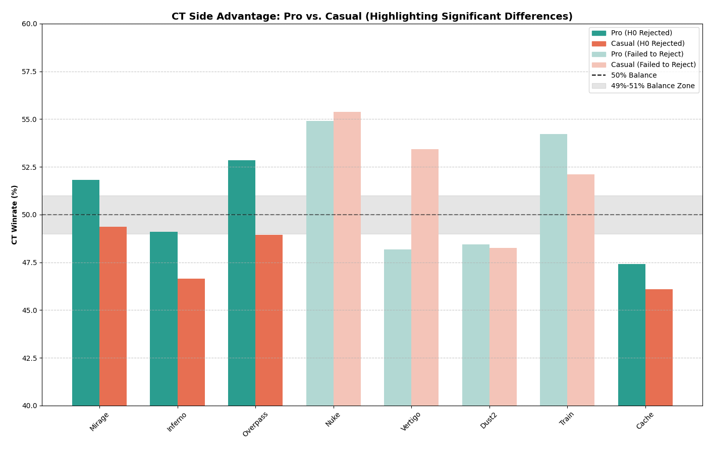

# Statistics project - Report

The main goal of the project is to find out that skill in Counter Strike Global Offensive affects winrate dependent on the side, Counter-Terrorist or Terrorist (later just CT and T).

The game has 30 rounds and whoever wins 16 of them wins immedately. Also after 15 rounds there is switch between the teams.

I will be comparing pro scene (top 20 tournaments) with casual matches (later matchmaking).

## Statistical method

I decided to use the method called **Test of the hypothesis** and **Two-Proportion Z-Test**.

My hypothesis **H0** is that skill does **NOT** affect winrate on each side. 

That does **NOT** mean that every map is balanced, it means that if the map is biased (e.g. to the CT side) pro players and casual ones would have similar winrate.

Alternative (and the only 1) hypothesis **H1** is that skill affects winrate.

For `Two-Proportion Z-test` the samples should be independent (and they are) and the sample size is large enough, which is also true (on some maps).

I think that other methods will be somehow useless or too complicated for "prooving" my hypothesis.

## Desicions and sources

There is possibility to download each match from the HLTV (official web page) but the problem is that it would require absurd amount of storage (because each match has around 200MB). Even though it has good python library `awpy` for doing that.

So it was decided to use data from the internet (Kaagle), these people used exactly this library.

Sources:

- Pro matches:

    https://www.kaggle.com/datasets/mateusdmachado/csgo-professional-matches/data

- Matchmaking (casual players):

    https://www.kaggle.com/datasets/skihikingkevin/csgo-matchmaking-damage

In this section I would name only 1 problem with these data (other are in the sections below). The problem is that matchmaking data are small (map Vertigo has only 3 matches). But despite it I decided to keep it and didn't erase these small data. (You will see exact amount in the output of the program).

For some reason despite the game is very popular I found only these 2 good (and big) data sets.

There was also a small check if data are meaningful and don't contain duplicit values (they don't).

## Data

Data are a bit different (meaning number of columns, their names, etc), and also these data have some redundant values (like number of headshots).

Data summary you can find in command line output file.

The biggest problem was getting used to `pandas` and `mathplotlib` and parse the data into suitable variables.

Note that this repo doesn't contain the data, so the `script.py` won't work.

### Describing the code

Code is divided into 4 parts:

1) Initializing and loading:

    That is the simpliest part, code initialize emtry variables (lists) and maps that will be used.
    Parses CSV into data frames and returns it.

    The code is in `main` function and `load_data`.

2) Extracting the data:

    For every map there will be called `calculate_map_stats` that will return 2 tuples: 
    `(pro_ct_wins, pro_total_rounds), (casual_ct_wins, casual_total_rounds)`.

3) Z-test:

    This tuple with map name will be used in `run_test_for_map`, interestingly enough this is very simple part because then it will make tuples and send it to the library function `proportions_ztest` and that will return `z_stat` and `p_value` then function will just print it out to the console.

4) Graph:

    Since `run_test_for_map` returns `p_value` I will be able to construct a simple graph using `plot_winrates(plot_maps, plot_pro, plot_casual, plot_p_values)`, `plot_...` variables are lists that are filled with data from for cycle of maps. Then the function will draw a graph based on these data.

Whole code is in the same folder named `script.py`.

## Results

This graph shows winrates of the CT sides on each maps.

Note: There is no point to show T side winrate because it is a complement.

There is dotted line in the middle showing 50% winrate and grey zone of 49-51%. That zone doesn't affect the results and shows just how much the side is biased (or unbiased).

Columns with high contrast colors are maps that rejected the null hypothesis. That means the side advantage (usually CT) changes significantly depending on the skill of the players.

Note: There is map `Vertigo` that has low contrast but that is because of the problem I meantioned earlier, `Z test` had small amount of the data and because of that `p value` is high and hypothesis wasn't rejected.

There is whole command line output is in the same folder named `command_line_output`.

### Conclusion

The graph (command line output to be exact) shows that some maps like `Mirage`, `Inferno`, `Overpass` and `Cache` are affected by skill. The winrate of pro players and average players is different, graph also shows that the winrate on CT side of pro players is higher than CT side of less experienced players.

#### Personal view

These results are exactly what I was expecting since I play this game a long time so among the players there is always preference to start as CT because it is much easier and can lead to victory much faster, because after winning some rounds oponent can surrender (even though he could come back on the CT side). 

The only thing that I didn't expect is that pro players on many maps secures that and their win rate on CT is even higher.

## Discussion

Since this is an online game I must mention that the data was probably affected by non-competitive forces like bots, cheaters and trolls (even in pro scene) and the percentage in matchmaking will be higher (personal opinion).

Since the Two-Proportion Z-Test needs independent events, however, in Counter-Strike, rounds are strictly dependent due to the game's economy. Winning a round grants a team better weapons and utility for the next round and increasing their chances of winning in the next round. However 2 different matches are truly independent so this error could be neglected.

Also data could be affected by preferences of the players, by that I mean that newbies can ignore one map (for example `Nuke`) and they could play only on 1 map (personally I think it would be `Mirage`).
